# Xray

- [Xray](#xray)
- [Description](#description)
- [Modes](#modes)
  - [Xray](#xray-1)
    - [Example](#example)
    - [Config](#config)
    - [Block selection](#block-selection)
    - [Templates](#templates)
  - [ESP and Tracers](#esp-and-tracers)
    - [Example](#example-1)
    - [Config](#config-1)
    - [Entity selection](#entity-selection)
    - [Templates](#templates-1)
  - [Fullbright](#fullbright)
  - [Location](#location)
    - [Example](#example-2)
    - [Config](#config-2)
  - [Global config](#global-config)

# Description

Bored by finding your diamonds legitimately? This mod is for you!

This mod includes a Xray, an entity tracer and an entity ESP.

# Modes

Here is the main menu, you can select configs.

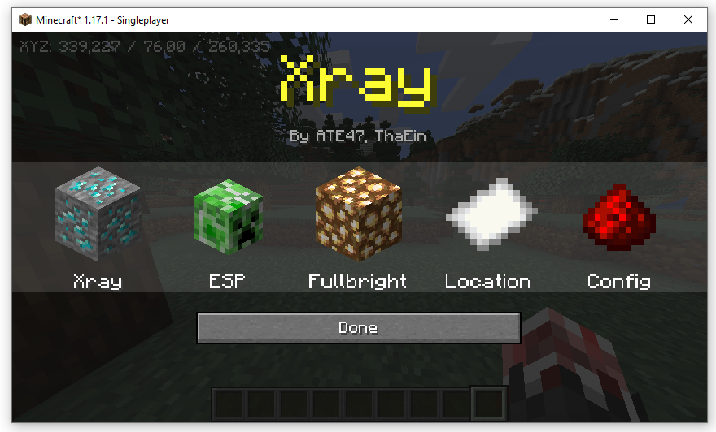

## Xray

### Example

**Xray**

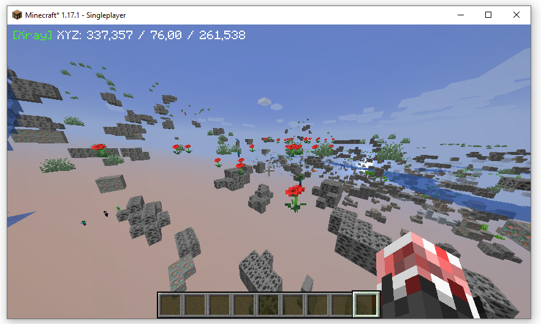

**Cave**

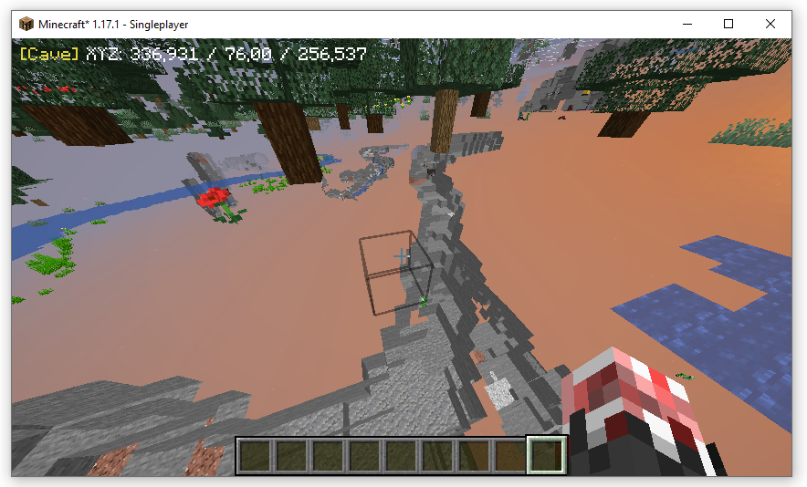

**Redstone**

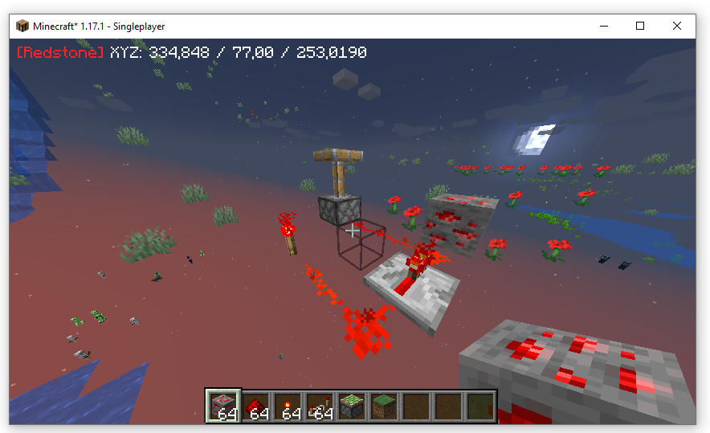

### Config

In the Xray menu you can set you Xray modes.

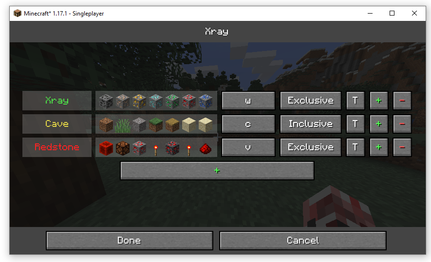

The Menu is composed of buttons:

- `"name"` - Update the color and the name of the mode
- `blocks` - Set the blocks of this mode
- `"key"` - Set the key of the mode
- `Inclusive/Exclusive` - Set how the mode should handle the blocks:
  - Exclusive : Like with the Xray Mode
  - Inclusive : Like with the Cave Mode
- `T` - Select a template
- `+` - New mode
- `-` - Delete this mode

### Block selection

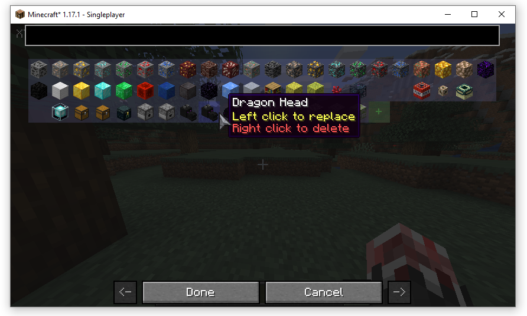

### Templates

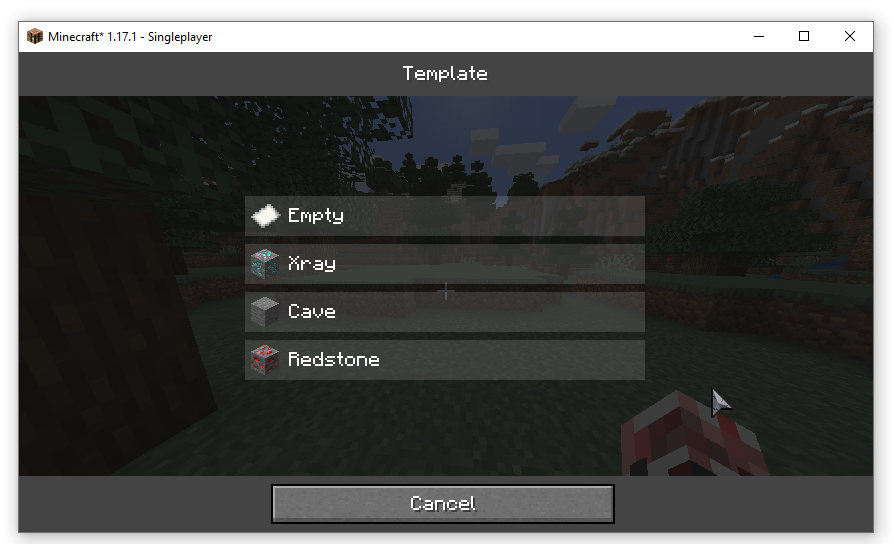

## ESP and Tracers

### Example

**ESP**

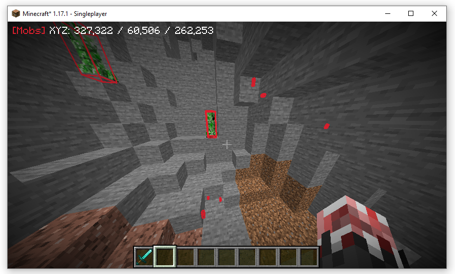

**Tracers**

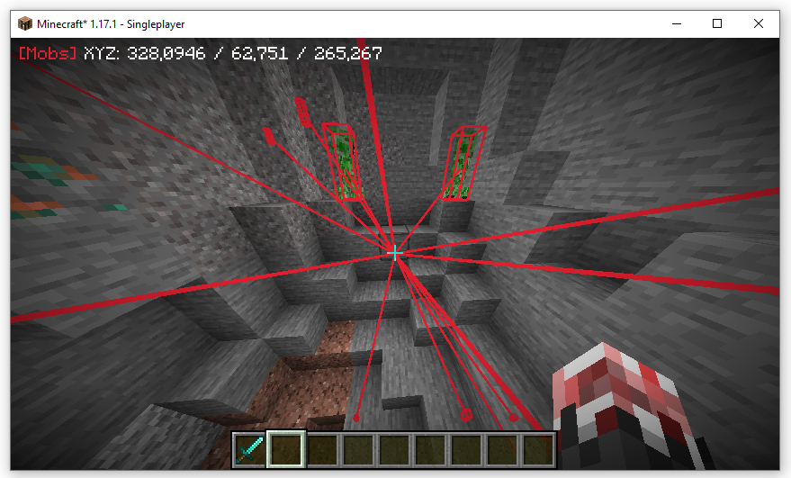

### Config

In the ESP menu you can set you ESP modes.

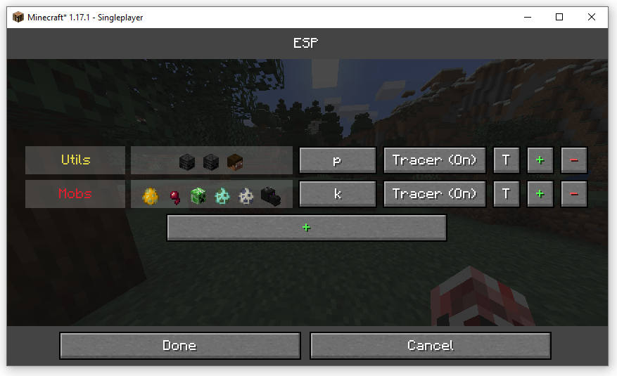

The Menu is composed of buttons:

- `"name"` - Update the color and the name of the mode
- `entities` - Set the entities of this mode
- `"key"` - Set the key of the mode
- `Tracer (On/Off)` - Toggle the tracers for this mode
- `T` - Select a template
- `+` - New mode
- `-` - Delete this mode

### Entity selection

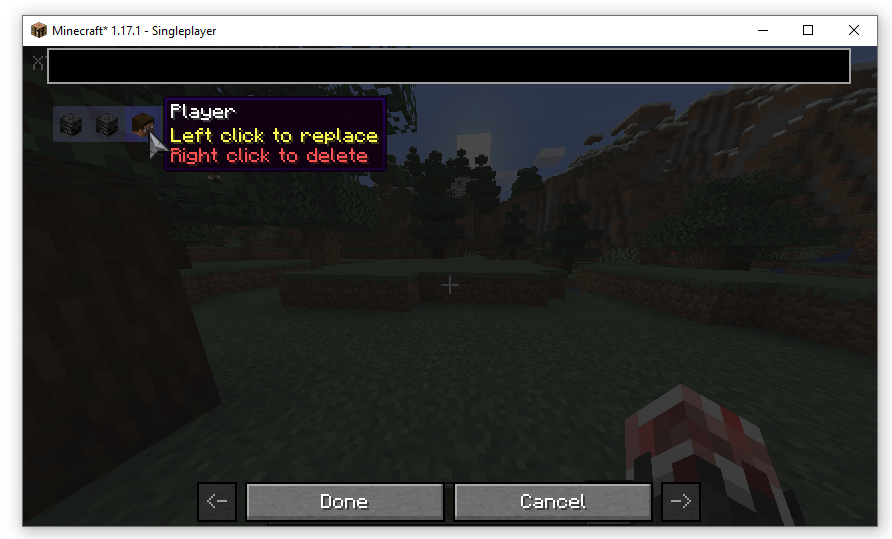

### Templates

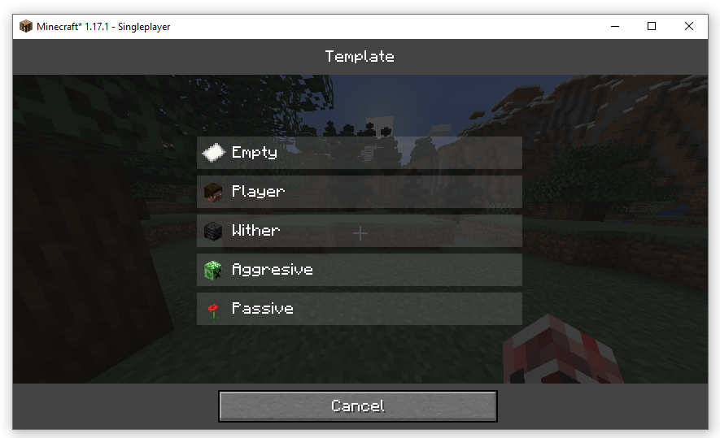

## Fullbright

The fullbright remove the light in the game.

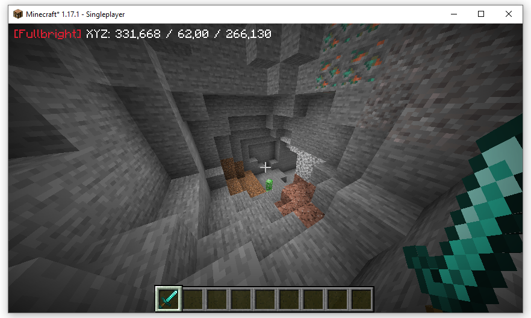

## Location

### Example

### Config

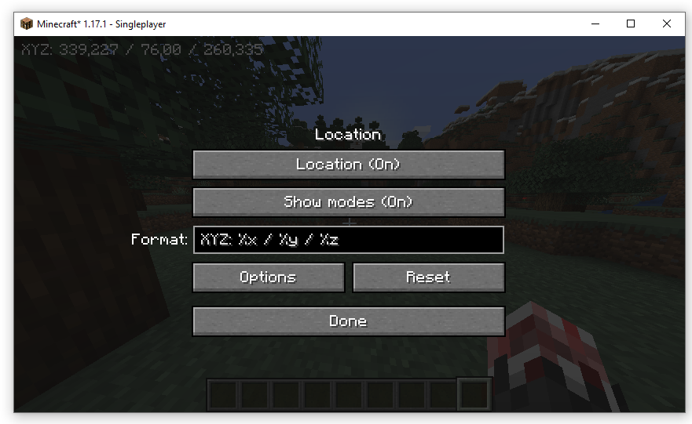

You can config:

- `Location` - Enable or not the location
- `Show modes` - Show or not the current modes (ESP+Xray+Fullbright)
- `Format` - Set the location format
- `Options` - Add custom options to the format
- `Reset` - Reset the format

## Global config

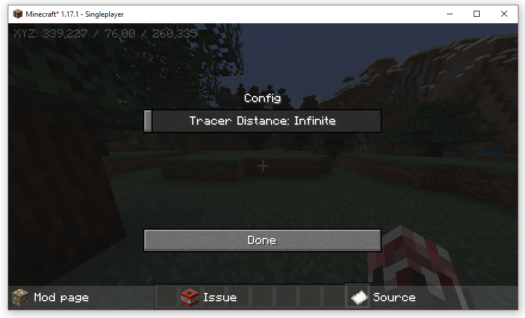

You can config:

- `Tracer Distance` - Set the maximum range of the tracer
