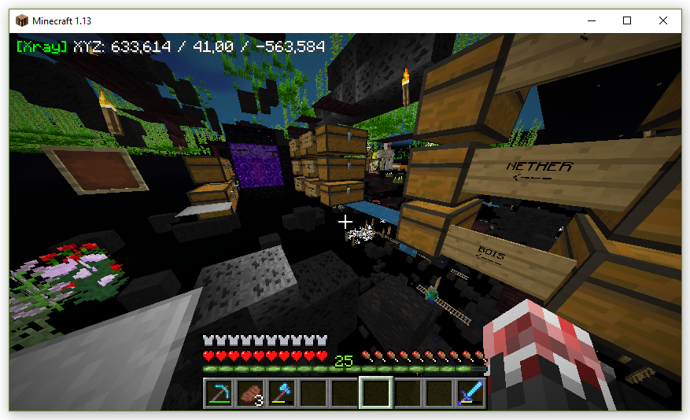
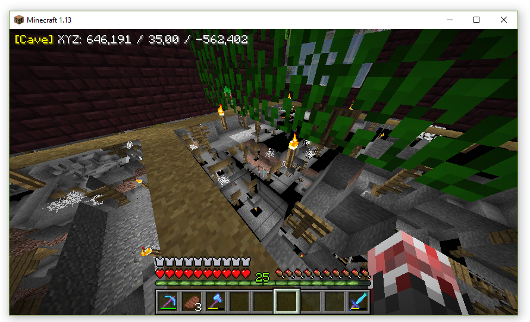
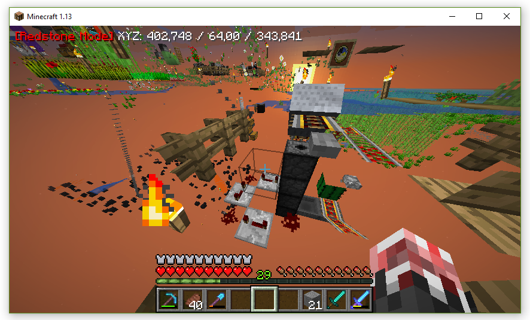
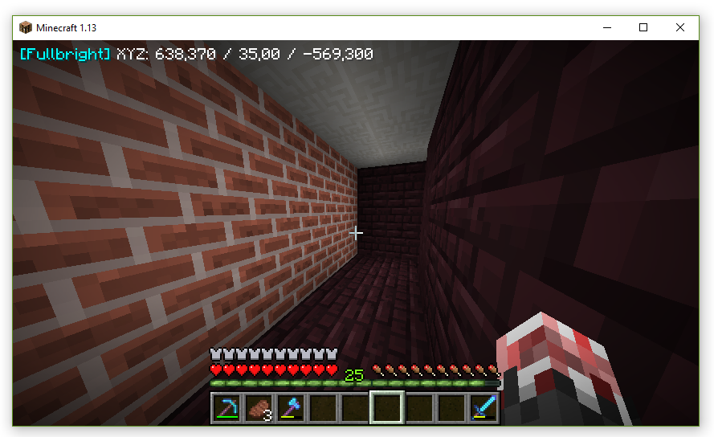
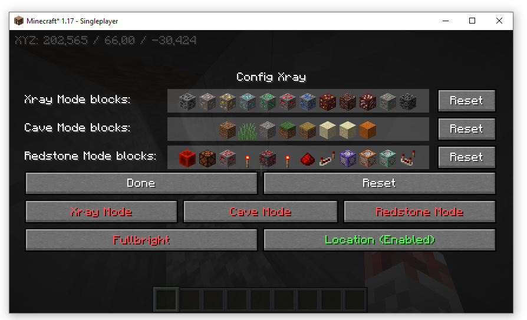
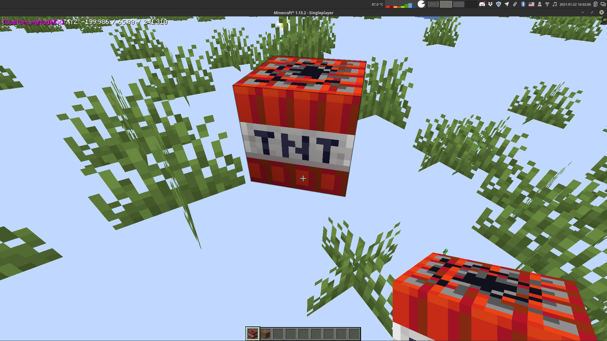
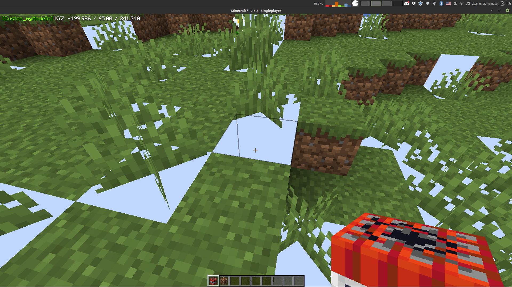

# Xray

## Original

Author: [ATE47](https://github.com/ate47)
- [GitHub](https://github.com/ate47/Xray)
- [Curse](https://minecraft.curseforge.com/projects/xray-1-13-rift-modloader)

## Description

Bored by finding your diamonds legitimately? This mod is for you!

### Configs
5 keys (can be changed in config)

- X: **toggle Xray**<br/>
    

- C: **toggle Cave Mode**<br/>
    

- R: **toggle Redstone Mode**<br/>
    

- H: **toggle Fullbright** (No light needed)<br/>
    

- N: **Open Xray menu**<br/>
    Here you can enable/disable Xray, Cave Mode, Redstone Mode, Fullbright and 
    location on the HUD and add/remove to /reset Blocks lists of cave, redstone and Xray mode<br/>
    

### Custom modes
You can create you own mode in Xray by adding in the `xray.json` in `customModes` names of new `<modeName>:<type>`

Types are:
- EXCLUSIVE: like in Xray and Redstone mode
- INCLUSIVE: like in Cave Mode

For example:
```json
{
  "customModes": ["myModeEx:EXCLUSIVE", "myModeIn:INCLUSIVE"],
  "Custom_myModeExBlocks": ["minecraft:tnt"],
  "Custom_myModeInBlocks": ["minecraft:dirt"]
}
```

Will create a custom modes named "myModeEx"(exclusive. shows only tnt) and "myModeIn"(inclusive. shows only dirt sides)

| Custom Mode | Screenshot                     |
|-------------|--------------------------------|
| myModeEx    |  |
| myModeIn    |  |

> Note: block list must be named like `Custom_<modeName>Blocks`


